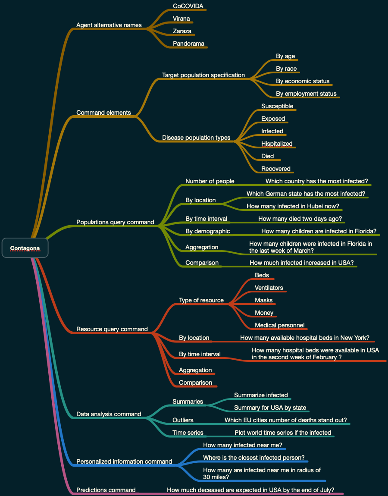

# Contagona

This project has documents and diagrams for design and implementation
of a conversational agent named “Contagona” aimed at providing answers 
to contagious disease questions. 

Project's goal is to make a general component design and a more or less complete grammar
for the envisioned dialogs.

Here is a mind-map that outlines of the scope of the project:

 
 
 