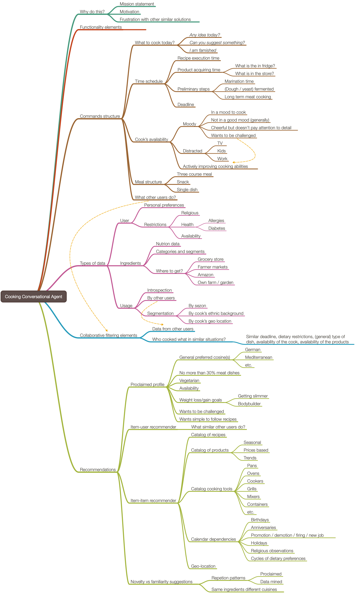

# Culina

This project has documents and diagrams for design and implementation
of a conversational agent named “Culina” aimed at facilitating the  
to food preparation (cooking) activities. 

Project's goal is to make a general component design and a more or less complete grammar
for the envisioned dialogs.

Here is a mind-map that outlines of the scope of the project:

 
 
## Similarities with Glukoza
 
Culina is very similar to the conversational agent 
[Glukoza](../Glukoza)
in both component design and grammar design and elements.