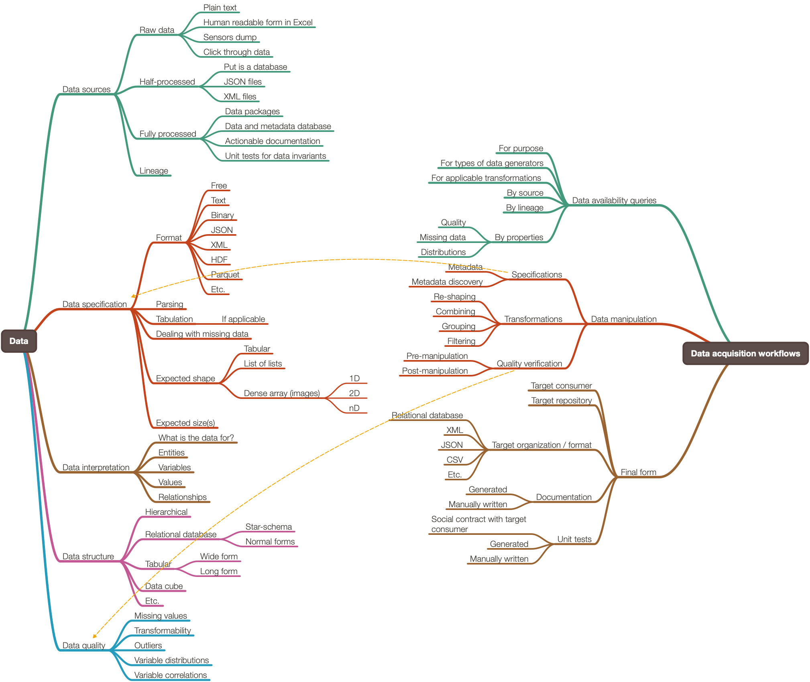
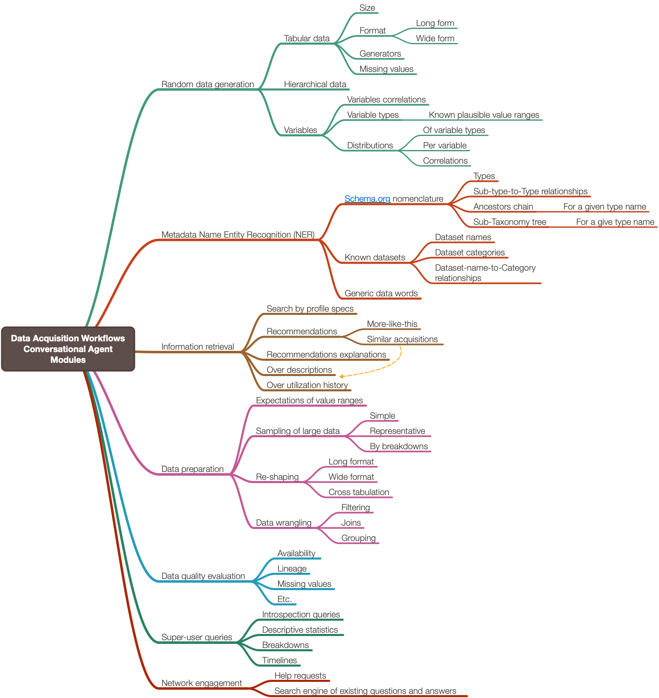
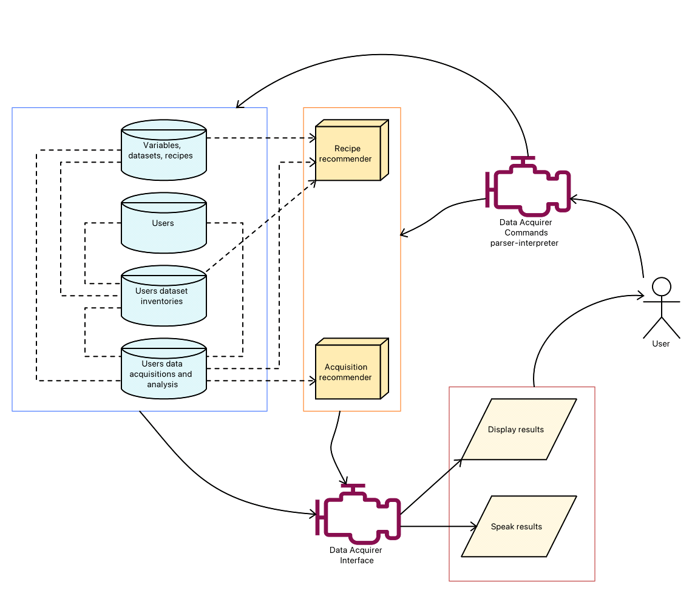

# Data Acquirer

## In brief

This project has documents and diagrams for design and implementation
of a conversational agent named “Data Acquirer” aimed at providing code or data 
to data acquisition commands.

Project's goal is to make a general component design and a more or less complete grammar
for the envisioned dialogs.

Here is a mind-map that outlines of the scope of the project:

[](./Data-Acquisition-Workflows-mind-map.pdf) 
 
Here is a mind-map that shows the components of the conversational agent:

[](./Diagrams/Data-Acquisition-Workflows-Conversational-Agent-Modules-mind-map.pdf)

See the corresponding Raku packages [AAr1, AAr2].

------ 

## Utilization / deployment

The following diagram shows one way of using DataAcquirer:  

[](./Diagrams/Data-Acquisition-Workflows-components-interaction.pdf)


------ 

## Similarities with Sous Chef Susana 
 
DataAcquirer is very similar to the conversational agent 
[Sous Chef Susana](../SousChefSusana)
in both component design and grammar design and elements.

See also the Raku package:
[DSL::English::FoodPreparationWorkflows](https://github.com/antononcube/Raku-DSL-English-FoodPreparationWorkflows),
[AAr3].

------ 

## CLI interface

We can have a Command Line Interface (CLI) with which we can specify
a chain (UNIX-like pipeline) of commands:

```shell
dsl translate -c "get a sample of 3000 JSON commodity files from AWS; 
                  parse them into long form data frame; 
                  make a data package for them; 
                  open a notebook with that data package loaded" | 
dsl data-acquire | 
dsl data-wrangle |
dsl make-notebook
```

The chain of four commands above:

1. Parses and interprets the natural language commands
   - And produces, say, JSON or XML records that have executable code.
2. Gets the commodities files from some default location
   - Might ask for credentials.  
3. Uses *some* JSON parsing package in *some* programming language to make the long form data frame
4. Makes a data package with the long form data frame 
   - Python and R data packages are regular packages.
   - WL data package can be a resource function or resource object.
5. Uploads the data package in some repository
   - Local packages installation folder or a private cloud.
7. Creates a notebook and populates with command(s) loading the data package
8. Opens the notebook in some notebook interpreter.
   - Jupyter notebooks can be opened in a Web browser or VSCode.
   - R notebooks, in IntelliJ or RStudio
   - WL/Mathematica notebooks, in Mathematica
   
Of course the command `data-acquire` might/should ask for credentials.

Similarly, all commands can take user spec, e.g. `-u joedoe32`. 

------ 

## References

[AAr1] Anton Antonov,
[DSL::Entity::Metadata Raku package](https://github.com/antononcube/Raku-DSL-Entity-Metadata), 
(2021),
[GitHub/antononcube](https://github.com/antononcube).

[AAr2] Anton Antonov,
[DSL::English::DataAcquisitionWorkflows Raku package](https://github.com/antononcube/Raku-DSL-English-DataAcquisitionWorkflows), 
(2021),
[GitHub/antononcube](https://github.com/antononcube).

[AAr3] Anton Antonov,
[DSL::English::FoodPreparationWorkflows Raku package](https://github.com/antononcube/Raku-DSL-English-FoodPreparationWorkflows), 
(2021),
[GitHub/antononcube](https://github.com/antononcube).
