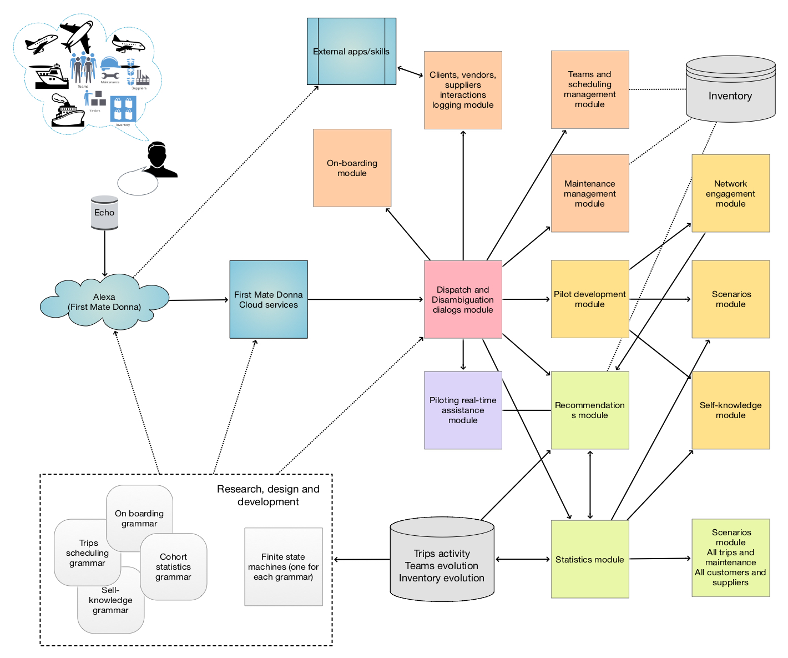

# First Mate Donna

## In brief

This project has documents and diagrams for design and implementation
of a conversational agent named “First Mate Donna” aimed at providing code or data
to commands airplane fleet and ships fleet relate workflows.

Project's goal is to make a general component design and a more or less complete grammar
for the envisioned dialogs.

Here is a diagram of the components of First Mate Donna:

[](./Diagrams/First-Mate-Donna-design.pdf)


------ 

## Examples

Open a Raku IDE or type `raku` in the command line program. Try this Raku code:

```raku
use DSL::English::FirstMateDonna;

say ToFirstMateWorkflowCode(
    "which airplane can i send off in the next two hours?
     why did you recommend that?",
    "WL-FirstMate");
``` 

Here is a more complicated, statistics pipeline specification:

```raku
say ToFirstMateWorkflowCode(
    "how many people traveled with us last month;
     what is the breakdown of destinations over sources;
     for which destinations fuel is consumed the most;
     plot the results;", "WL-FirstMate")
```

Here is a recommendations (by collaborative filtering) specification:

```raku
say ToFirstMateWorkflowCode(
    "what flight companies like ours scheduled last week;
     which of those I can schedule this month;
     show me the required teams and planes;", "WL-FirstMate")
```

The command above should print out WL code for the WL package `...`

    TBD...


------ 

## Similarities with Sous Chef Susana

First Mate Donna is very similar to the conversational agent
[Sous Chef Susana](../SousChefSusana)
in both component design and grammar design and elements.

Other similar conversational agents are:

- [Data Acquirer](../DataAcquirer)
- [Head Huntress Gemma](../HeadHuntressGemma)

Here is a comparison diagram:


