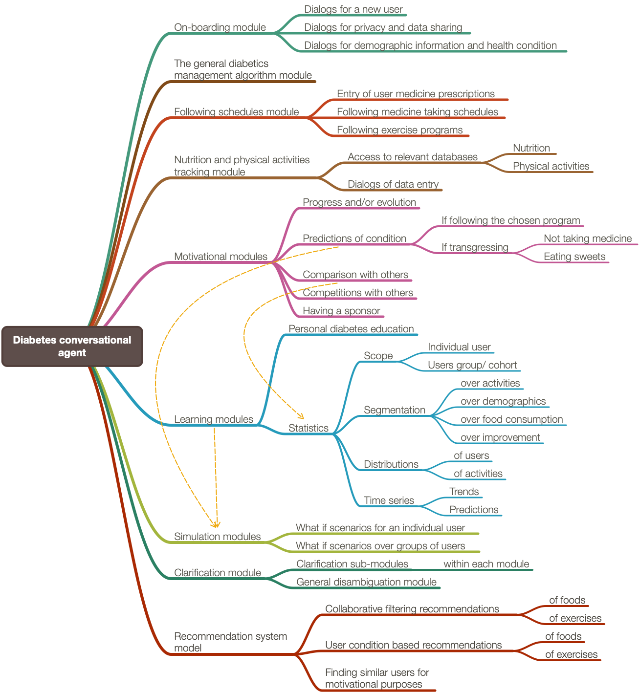

# Glukoza

This project has documents and diagrams for design and implementation
of a proposed Conversational Agent (CA) named "Glukoza"
for the [“Alexa Diabetes Challenge” competition](https://www.alexadiabeteschallenge.com).

------

## Conversational agent design

The following component diagram shows the design of Glukoza:

The following mind-map shows the CA elements:

Here are documents with more detailed explanations:

- ["Morphological analysis of GLUKOZA’s conversational agent elements over functionalities-vs-data breakdown"](./Documents/Morphological-analysis-of-GLUKOZA's-CA-elements-over-Functionalities-vs-Data.pdf)

- ["GLUKOZA grammars"](./Documents/GLUKOZA-grammars.pdf)

- ["GLUKOZA -- design, explanations, and rationale of a diabetes management conversational agent"](./Documents/GLUKOZA-design-explanations-and-rationale-of-a-diabetes-management-conversational-agent.pdf)

------

## Similarities with other agents

Glukoza is very similar to the CAs 
[Sous Chef Susana](../SousChefSusana) 
and
[Head Huntress Gemma](../HeadHuntressGemma).
