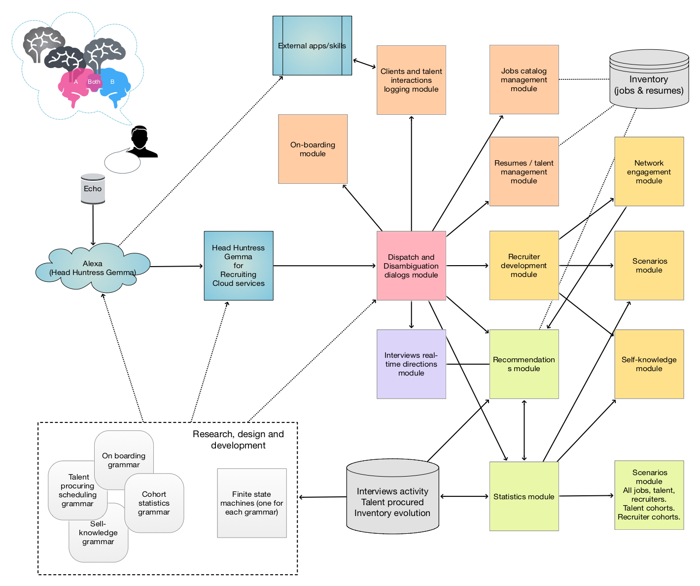

# Head Huntress Gemma

## Introduction

This project has documents and diagrams for design and implementation
of a conversational agent named “Head Huntress Gemma” aimed at facilitating 
of job-related recruiting activities. (And more generally, matchmaking activities.)

**Remark:** More precisely, jobs recruiting support and analysis.

Project's goal is to make a general component design and a more or less complete grammar
for the envisioned dialogs.

Here is a mind-map that outlines of the scope of the project:

*TBD...*

Here is a diagram of the components of Head Huntress Gemma:

------

## Similarities with other conversational agents
 
Gemma is very similar to the conversational agents 
[Sous Chef Susana](../SousChefSusana) 
and
[Glukoza](../Glukoza)
in both component design and grammar design and elements.

------

## Name selection

The name "Gemma" was chosen because of the phrase "diamond in the rough" (i.e. "gem in the rough"), 
and because it is short, memorable, and fairly unique. (See 
[WolframAlpha's result for "Gemma name"](https://www.wolframalpha.com/input/?i=Gemma+name).)

(Additional alluding references:
the fictional character 
[Gemma Teller Morrow](https://en.wikipedia.org/wiki/Gemma_Teller_Morrow),
the phrase
["burying one's talents"](https://en.wikipedia.org/wiki/Parable_of_the_talents_or_minas).)

Several other names are considered. They are listed below together with some discussion points.

- Head Hunter Assistant   
  Too generic.
  
- Talent Scout Assistant  
  Sounds good, but abbreviates to TSA. (Which is the same as "Transportation Security Administration.")
  
- Matchmaker Melina   
  With this name we go to the more general perspective of "matchmaking of minds."
    
- Matchmaker Martina  
  Similar to the one above, but with "Martina" we allude to "mart".

------

## References

[AAv1] Anton Antonov, 
["Voice-Grammar-Compute-Communicate: Take Control of Your Health Data"](https://www.youtube.com/watch?v=_rI1RxkeAcA),
(2018),
[Wolfram Channel at YouTube](https://www.youtube.com/channel/UCJekgf6k62CQHdENWf2NgAQ).

[AAr1] Anton Antonov
[DSL::English::RecruitingWorkflows Raku package](https://github.com/antononcube/Raku-DSL-English-RecruitingWorkflows),
(2021),
[GitHub/antononcube](https://github.com/antononcube).
