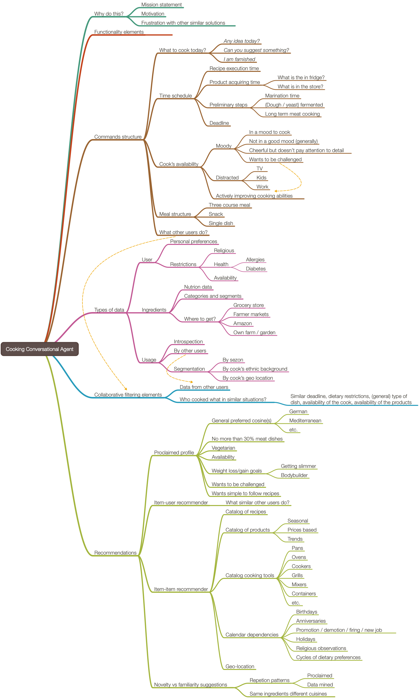
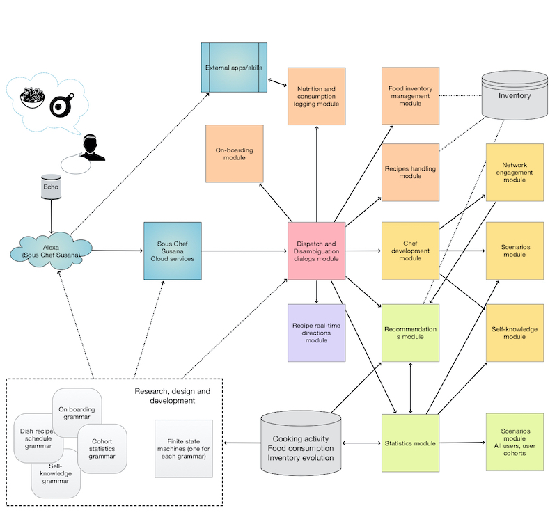

# Sous-chef Susana

This project has documents and diagrams for design and implementation
of a conversational agent named “Sous-chef-Susana” aimed at facilitating 
of food preparation (cooking) activities. (See [Wk1].) 

**Remark:** More precisely, food preparation support and analysis.

Project's goal is to make a general component design and a more or less complete grammar
for the envisioned dialogs.

Here is a mind-map that outlines of the scope of the project:

 

Here is a diagram of the components of Sous Chef Susana:

## Similarities with Glukoza
 
Susana is very similar to the conversational agent 
[Glukoza](../Glukoza)
in both component design and grammar design and elements.

## References

[Wk1] Wikipedia, [Sous-chef](https://en.wikipedia.org/wiki/Sous-chef).

[AAv1] Anton Antonov, 
["Voice-Grammar-Compute-Communicate: Take Control of Your Health Data"](https://www.youtube.com/watch?v=_rI1RxkeAcA),
(2018),
[Wolfram Channel at YouTube](https://www.youtube.com/channel/UCJekgf6k62CQHdENWf2NgAQ).