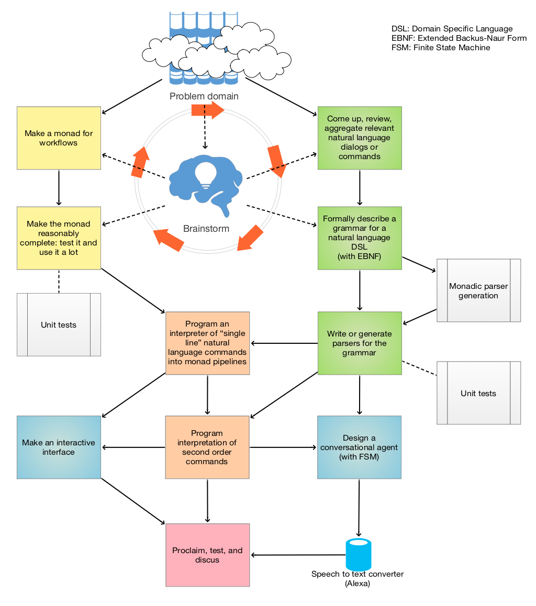

# ConversationalAgents

Articles, designs, and code for making conversational agents.

## Conversational agents for Machine Learning workflows

Currently the primary focus in this repository is the making of grammars and interpreters that 
generate programming code for Machine Learning (ML) workflows from sequences of natural language commands. 

The code generation is done through dedicated grammar parsers, ML software monads, and interpreters that map
the parser-derived abstract syntax trees into corresponding ML monads. 

Here is a diagram for the general, "big picture" approach:



The primary target are the programming languages R and Wolfram Language (WL). 
(Some of the Raku packages generate Python code, but at this point that is just for illustration purposes. 
There are no actual implementations for the generated Python pipelines.)


### Example 

The following example shows monadic pipeline generation of Latent Semantic Analysis (LSA) workflows
in both R and WL using: 

- the Raku (Perl 6) package [LatentSemanticAnalysisWorkflows](./Packages/Perl6/LatentSemanticAnalysisWorkflows),

- the R package [LSAMon-R](https://github.com/antononcube/R-packages/tree/master/LSAMon-R), and

- the WL package [MonadicLatentSemanticAnalysis.m](https://github.com/antononcube/MathematicaForPrediction/blob/master/MonadicProgramming/MonadicLatentSemanticAnalysis.m).

Note that:

- the sequences of natural commands are the same;

- the generated R and WL code pipelines are similar because the corresponding packages have similar implementations.

---

This Raku (Perl 6) command assigns a sequence of natural commands to a variable:

```perl6
my $command ='
create from aText;
make document term matrix with no stemming and automatic stop words;
echo data summary;
apply lsi functions global weight function idf, local term weight function none, normalizer function cosine;
extract 12 topics using method NNMF and max steps 12;
show topics table with 12 columns and 10 terms;
show thesaurus table for sing, left, home;
';
```

---

This Raku (Perl 6) command:

```perl6
say to_LSAMon_R($command);
```

generates this R code:

```r
LSAMonUnit(aText) %>%
LSAMonMakeDocumentTermMatrix( stemWordsQ = NA, stopWords = NULL) %>%
LSAMonEchoDocumentTermMatrixStatistics( ) %>%
LSAMonApplyTermWeightFunctions(globalWeightFunction = "IDF", localWeightFunction = "None", normalizerFunction = "Cosine") %>%
LSAMonExtractTopics( numberOfTopics = 12, method = "NNMF",  maxSteps = 12) %>%
LSAMonEchoTopicsTable(numberOfTableColumns = 12, numberOfTerms = 10) %>%
LSAMonEchoStatisticalThesaurus( words = c("sing", "left", "home"))
```

---

This Raku (Perl 6) command:

```perl6
say to_LSAMon_WL($command);
```

generates this WL code:

```mathematica
LSAMonUnit[aText] ⟹
LSAMonMakeDocumentTermMatrix[ "StemmingRules" -> None, "StopWords" -> Automatic] ⟹
LSAMonEchoDocumentTermMatrixStatistics[ ] ⟹
LSAMonApplyTermWeightFunctions["GlobalWeightFunction" -> "IDF", "LocalWeightFunction" -> "None", "NormalizerFunction" -> "Cosine"] ⟹
LSAMonExtractTopics["NumberOfTopics" -> 12, Method -> "NNMF", "MaxSteps" -> 12] ⟹
LSAMonEchoTopicsTable["NumberOfTableColumns" -> 12, "NumberOfTerms" -> 10] ⟹
LSAMonEchoStatisticalThesaurus[ "Words" -> { "sing", "left", "home" }]
```

--- 

This Raku (Perl 6) command:

```perl6
say to_LSAMon_Python($command);
```

generates this Python code:

```python
obj = LSAMonUnit(aText);
obj = LSAMonMakeDocumentTermMatrix( lsaObj = obj, stemWordsQ = NA, stopWords = NULL);
obj = LSAMonEchoDocumentTermMatrixStatistics( lsaObj = obj );
obj = LSAMonApplyTermWeightFunctions( lsaObj = obj, globalWeightFunction = "IDF", localWeightFunction = "None", normalizerFunction = "Cosine");
obj = LSAMonExtractTopics( lsaObj = obj, numberOfTopics = 12, method = "NNMF",  maxSteps = 12);
obj = LSAMonEchoTopicsTable( lsaObj = obj, numberOfTableColumns = 12, numberOfTerms = 10);
obj = LSAMonEchoStatisticalThesaurus( lsaObj = obj, words = c("sing", "left", "home"))
```

Note that the Python code above shows how to interpret the R and WL monadic pipelines above
into sequences of imperative commands.

------

## Support & appreciation

[](https://www.buymeacoffee.com/antonov70)

😅 ☕️ 😀

------

Anton Antonov
11.01.2017 Florida, USA
05.02.2020 Florida, USA (update)
29.10.2022 Florida, USA (update)